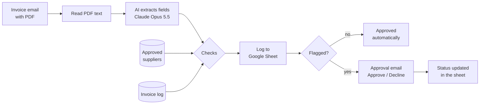

# Invoice Intake Automation (n8n + AI)

A no-code workflow that reads supplier invoices from an email inbox, extracts the details with AI, logs them to Google Sheets, and asks a manager to approve anything unusual, with one click in an email.

- **160 / 160 fields extracted correctly** across 20 test invoices: 3 layouts, 4 date formats, 3 currencies, and invoices in German
- **20 / 20 invoices routed correctly**: duplicates, unapproved suppliers and large amounts sent for approval; everything else logged automatically
- **About 2 seconds per invoice**, versus several minutes of manual typing

<!-- Demo: add the recording as docs/demo.gif and uncomment the next line -->
<!--  -->

## The business problem

Kildare Craft Coffee Ltd (a fictional small business) receives supplier invoices by email as PDFs. Someone opens each one, types the details into a spreadsheet, checks the supplier and amount, and chases approval for anything unusual. It is slow, easy to get wrong, and duplicate invoices slip through.

Most small businesses already use email and spreadsheets, so the goal was to automate the work **inside the tools they already have**, without custom software.

## How it works

| Step | n8n node | What it does |
| --- | --- | --- |
| 1 | Email Trigger (IMAP) | Watches a Gmail inbox and downloads PDF attachments |
| 2 | Extract from File | Turns the PDF into text |
| 3 | Information Extractor + Anthropic Chat Model | AI pulls out supplier, invoice number, dates, currency, subtotal, VAT and total, in a fixed format |
| 4–5 | Google Sheets | Reads the approved supplier list and the invoices already logged |
| 6 | Code (a few lines) | Flags **duplicates** (same supplier and invoice number), **new suppliers** (not on the approved list) and **high amounts** (over 10,000) |
| 7 | Google Sheets | Logs every invoice with its flags and status |
| 8–12 | If, Loop Over Items, Send Email (send and wait), Google Sheets | Emails the manager about each flagged invoice, waits for Approve / Decline, and records the decision |

## Results

Tested on 20 generated invoices (`generate_invoices.py`) with a known answer key (`answer_key.csv`), scored by `evaluate.py`.

| | Run 1 | Run 2 (after fixes) |
| --- | --- | --- |
| Fields extracted correctly | 158 / 160 (98.8%) | **160 / 160 (100%)** |
| Invoices routed correctly | 18 / 20 | **20 / 20** |
| Approval decisions recorded | 0 / 5 (bug) | **5 / 5** |

**What run 1 taught us**

- **The AI is excellent at numbers and dates.** All 140 amounts, dates, currencies and invoice numbers were correct in both runs, including German invoices and four different date formats.
- **Names in capital letters are its weak spot, and the mistakes are intermittent.** In run 1 it read "KAFFEERÖSTEREI" as "Kafferösterei" on 2 invoices. That one-letter typo made an approved supplier look new and hid a duplicate invoice. In run 2 the AI read the same invoices correctly. The fix is not to hope the AI gets it right; it is a safety net: extracted supplier names are matched to the approved list allowing up to 2 letters' difference, and the official name is recorded. Results are now consistent however the AI reads the name on a given day.
- **A stray space in a column header** ("id " instead of "id") silently broke the approval update. Small set-up details matter as much as the AI.

## Run it yourself

1. Install [Node.js](https://nodejs.org) and n8n (`npm install -g n8n`), then run `n8n start` and open http://localhost:5678.
2. Import `workflow/invoice-intake.json` (Workflows, then Import from file).
3. Create the credentials in n8n:
   - **IMAP and SMTP:** a Gmail address with a Google [app password](https://myaccount.google.com/apppasswords) (`imap.gmail.com:993`, `smtp.gmail.com:465`)
   - **Anthropic:** an API key from console.anthropic.com
   - **Google Sheets OAuth2:** a Google Cloud OAuth client (Web application) with redirect URI `http://localhost:5678/rest/oauth2-credential/callback`
4. Create a Google Sheet with an `Invoices` tab (headers: `received_at, supplier, invoice_number, invoice_date, due_date, currency, subtotal, vat, total, flags, status, id`) and a `Suppliers` tab (import `suppliers.csv`).
5. To test: copy `invoices/*.pdf` to `~/.n8n-files/invoices/`, run the workflow from the manual trigger, answer the approval emails, export the Invoices tab to `results/sheet_export.csv`, and run `py evaluate.py`.

## Files

| File | Purpose |
| --- | --- |
| `workflow/invoice-intake.json` | The n8n workflow (no credentials included) |
| `generate_invoices.py` | Creates the 20 test invoice PDFs, the answer key and the supplier list |
| `invoices/` | The test invoices |
| `answer_key.csv` | Correct fields and flags for every test invoice |
| `evaluate.py` | Scores a sheet export against the answer key |
| `docs/case-study.md` | One-page case study: problem, solution, results, risks |

**Built with:** n8n, Claude Opus 5.5 (via n8n's Anthropic node), Gmail (IMAP/SMTP), Google Sheets, Python for test data and scoring.
