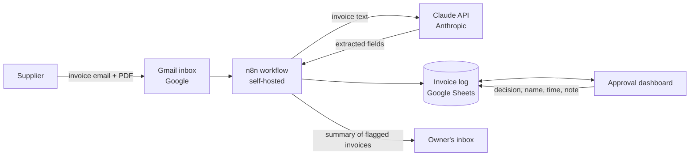

# Data Protection Impact Assessment: AI Invoice Intake

*Prepared by Alexandru Varzari as a portfolio exercise for a fictional business (Kildare Craft Coffee Ltd), following the structure of the Irish Data Protection Commission's sample DPIA template. Not legal advice.*

| | |
| --- | --- |
| **Controller** | Kildare Craft Coffee Ltd (fictional) |
| **System** | AI invoice intake: n8n workflow, Claude API, Gmail, Google Sheets, approval dashboard |
| **Assessment date** | October 2026 |
| **Outcome** | Processing can proceed once the measures in step 6 are in place. No high residual risk, so prior consultation with the DPC is not required. |

## Step 1: Identify the need for a DPIA

The project automates the processing of supplier invoices received by email. An AI service reads each invoice and extracts its details (supplier, invoice number, dates, amounts). The workflow checks them against business rules, logs them to a spreadsheet, and sends unusual invoices to the owner for approval on a dashboard.

The processing involves personal data of sole-trader suppliers (including bank details), contact persons at supplier companies, and staff recorded in the approval audit trail. A DPIA is carried out because the project uses new technology (AI) to process personal data, including financial details, and shares it with external service providers. The processing is not expected to be high-risk, but a DPIA is good practice before deployment.

## Step 2: Describe the processing

**Nature.** Suppliers email invoices (PDF) to a dedicated Gmail inbox. An n8n workflow reads each new email, extracts the PDF text and sends it to Anthropic's Claude API, which returns the invoice details. The workflow checks these against the approved supplier list and the invoices already logged, records every invoice in a Google Sheet, and emails the owner a summary of flagged invoices (duplicates, unknown suppliers, totals over €10,000). The owner approves or declines these on a dashboard, which records their name, the time and an optional note. Unflagged invoices are logged as approved automatically. Payment remains a separate, manual step.

**Copies of the data:** Gmail (original email and PDF), n8n's run history (invoice text and PDF), the AI provider (during processing), Google Sheets (invoice log) and notification emails.

**Scope.** About 30–60 invoices a month from 8–15 regular suppliers (assumption). Personal data: names, addresses, email addresses, phone numbers and bank details of sole-trader suppliers; names and contact details of staff at supplier companies; names of the café's staff in approval records. No special category data is expected, though it could appear in free text.

**Retention.** Invoices and the invoice log: six years, as required for Irish tax and accounting records, then deleted. Workflow run history, notification emails and copies held by processors: only as long as needed to process each invoice.

**Context.** Suppliers have an existing business relationship with the café and expect their invoices to be processed, but may not expect AI to be used. No children or vulnerable groups are involved.

**Purpose.** Process invoices faster and more accurately, catch duplicate or unusual invoices before payment, and keep an audit trail of approvals.

## Step 3: Consultation process

Before deployment: the owner (approver and decision-maker), the café manager and bookkeeper (users), and an IT or security adviser (access controls, account security, backups). The processors' data processing terms and security documentation (Google, Anthropic) will be reviewed. Suppliers will not be consulted individually; they will be informed through an updated privacy notice.

## Step 4: Assess necessity and proportionality

- **Lawful basis.** Contract (paying sole-trader suppliers); legal obligation (keeping invoices for six years under Irish tax law); legitimate interests (detecting duplicate and fraudulent invoices, processing invoices efficiently, handling supplier contact details, recording who approved each invoice). Consent is not appropriate, because the processing would continue regardless of it.
- **Does it achieve the purpose? Is there a less intrusive way?** Testing extracted 160 of 160 fields correctly across 20 invoices. The alternative, manual processing, involves staff reading the same data and is slower and more error-prone.
- **Data minimisation.** Only the eight required fields are stored in the invoice log. However, the AI receives each invoice's full text, including bank details it does not need (see risk 3).
- **Function creep.** The data is used only to process and pay invoices, not to profile suppliers or for any other purpose.
- **Data quality.** Arithmetic check (subtotal + VAT = total), matching against the approved supplier list, daily spot-checks of automatically approved invoices, and human approval of every exception.
- **Transparency and rights.** A supplier privacy notice will explain the processing (see risk 4). Requests for access or correction will be handled by the owner. Erasure requests are limited by the legal duty to keep invoices for six years.
- **Processors and international transfers.** Data processing agreements with Google and Anthropic will be checked before go-live. Both may process data outside the EU, so the transfer safeguards they rely on (for example, the EU–US Data Privacy Framework or Standard Contractual Clauses) must be confirmed.

## Step 5: Identify and assess risks

Overall risk combines likelihood (remote, possible, probable) and severity (minimal, significant, severe).

| # | Risk to individuals | Likelihood | Severity | Overall |
| --- | --- | --- | --- | --- |
| 1 | Unauthorised access to the Google Sheet or dashboard exposes sole traders' contact and bank details | Possible | Significant | Medium |
| 2 | The AI misreads an invoice, so a supplier is paid late or the wrong amount | Possible | Significant | Medium |
| 3 | A security incident at, or misuse by, a processor exposes invoice data, including bank details the AI does not need | Possible | Significant | Medium |
| 4 | Suppliers are not told their invoices are processed with AI and external services, so they cannot exercise their rights | Probable | Minimal | Medium |
| 5 | Copies of invoice data (n8n run history, notification emails) are kept longer than necessary | Possible | Minimal | Low |

## Step 6: Identify measures to reduce risk

| Risk | Measure | Effect | Residual risk | Approved |
| --- | --- | --- | --- | --- |
| 1. Unauthorised access | Least-privilege access: only the owner, manager and bookkeeper; individual logins for the dashboard instead of the shared token; 2-step verification on all Google accounts; sheet shared only with named people | Reduced | Low | Yes |
| 2. AI misreads an invoice | Keep the existing controls: arithmetic check, approved-supplier matching, human approval of all exceptions, daily spot-checks, and manual payment so no misread is paid automatically | Reduced | Low | Yes |
| 3. Processor exposure | Data processing agreements with Google and Anthropic, confirming no use of data for model training, retention limits, security and transfer safeguards; remove bank account numbers from the invoice text in n8n before it is sent to the AI | Reduced | Low | Yes |
| 4. Lack of transparency | Supplier privacy notice (GDPR Articles 13 and 14) on the website and in purchase terms: AI-assisted processing, named processors, six-year retention, how to exercise rights | Reduced | Low | Yes |
| 5. Excessive retention | Automatic deletion of n8n run history after 30 days; delete notification emails after 90 days; six-year deletion schedule for invoices and the log | Reduced | Low | Yes |

## Step 7: Sign off and record outcomes

| Item | Name / date | Notes |
| --- | --- | --- |
| Measures approved by | Owner, October 2026 | Measures in step 6 to be completed before go-live |
| Residual risks approved by | Owner, October 2026 | All residual risks low; no consultation with the DPC required |
| DPO advice | Not applicable | A small business is not required to appoint a Data Protection Officer under GDPR Article 37; advice to be sought from an external data protection adviser |
| Consultation responses | Owner | Feedback from staff and the IT adviser to be recorded before go-live |
| Review | Owner | Review after 12 months, or sooner if the system changes (new AI provider, new data, new purpose) |
